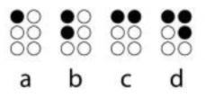

<p align="center">
  <h1 align="center">Binary Braille Parser</h1>
</p>

[](https://badge.fury.io/js/bin-braille-parser)


## How it works
Binary Braille, nicknamed BinBraille, is an abstraction from conventional Braille, in Braille each letter, symbol or number is represented by 6 possible points, where with the combination of these points the letters are formed, following an example:



In Binary Braille, we change the points marked by 1 and where we don't mark anything we put 0, for this variation of zeros and one, the abstraction is called Binary Braille.
The same pattern of letters in the image above would look like this in the Binary Braille system:

````js
[ "1", "0" ],  [ "1", "0" ],  [ "1", "1" ],  [ "1", "1" ]
[ "0", "0" ],  [ "1", "0" ],  [ "0", "0" ],  [ "0", "1" ]
[ "0", "0" ],  [ "0", "0" ],  [ "0", "0" ],  [ "0", "0" ]
     a              b		   c		  d
````
## Coverage

At the moment, character coverage is throughout the alphabet, numbers and single characters:
````bash
(",", ";", ":", "?", "!", "@", "-", "*", "&", "$", ">", "<", "=", "+", "/")
````

## Demo

Go to [this site](http://binary-braille-demo.surge.sh) and there you can test all the features of the parser.

## Installing

#### Via npm or yarn

```bash
npm i bin-braille-parser # or yarn add bin-braille-parser
```

## Disclaimer
This parser follows the Braille language in Brazilian standard, if you want to contribute with the conversion to other languages, feel free and submit your pull request. [**Check this official language support document.**](http://portal.mec.gov.br/docman/dezembro-2018-pdf/104041-anexo-grafia-braille-para-lingua-portguesa/file)

## Usage

```js
const parserTextToBinBraille = require('bin-braille-parser')

parserTextToBinBraille("Jonh snow")

/* The return is
 [ 
  [ [ '0', '1' ], [ '1', '1' ], [ '0', '0' ] ], J
  [ [ '1', '0' ], [ '0', '1' ], [ '1', '0' ] ], o
  [ [ '1', '1' ], [ '0', '1' ], [ '1', '0' ] ], n
  [ [ '1', '0' ], [ '1', '1' ], [ '0', '0' ] ], h
  [ [ '0', '0' ], [ '0', '0' ], [ '0', '0' ] ], 
  [ [ '0', '1' ], [ '1', '0' ], [ '1', '0' ] ], s
  [ [ '1', '1' ], [ '0', '1' ], [ '1', '0' ] ], n
  [ [ '1', '0' ], [ '0', '1' ], [ '1', '0' ] ], o
  [ [ '0', '1' ], [ '1', '1' ], [ '0', '1' ] ]  w
 ]
*/

```

## Running the tests

```bash
npm run test #or yarn test
```

----

<p align="center">
  <h5 align="center">Contribute to this project, send ideas and suggestions on <a href="https://github.com/Print-Dots/bin-braille-parser/issues">
  issues !</a></h5>
</p>
